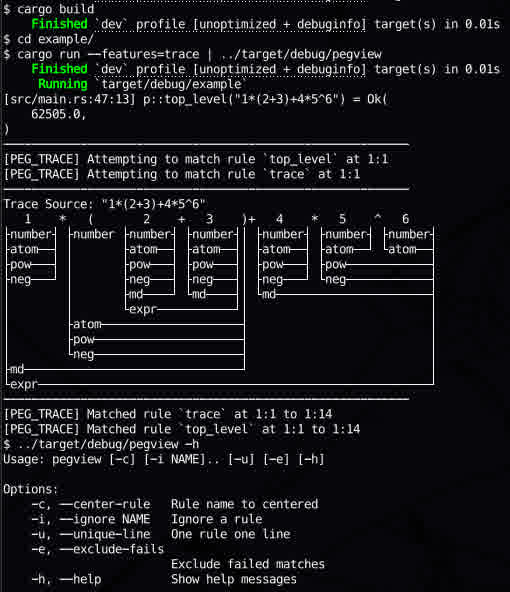

Tree visualization of [rust-peg] trace

# Example

[rust-peg]: https://github.com/kevinmehall/rust-peg/

# Features
- [x] Matched and Failed
- [x] Exclude failed rules
- [x] Zero width matched view
- [x] Full-width tab characters
- [x] Cached trace
- [ ] Precedence levels
